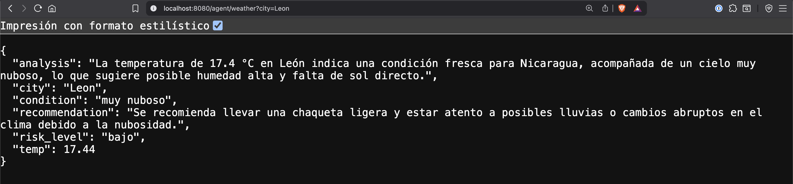
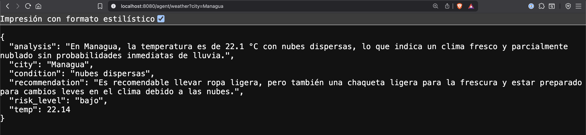

# 🌤️ Weather Agent

Un agente inteligente de clima desarrollado en Go que utiliza OpenAI GPT para analizar condiciones meteorológicas y proporcionar recomendaciones prácticas con evaluación de riesgo.

- Análisis detallado del clima
- Recomendaciones prácticas basadas en las condiciones
- Evaluación de nivel de riesgo (bajo, medio, alto)
- Arquitectura limpia con inyección de dependencias
- Manejo robusto de errores y timeouts
- Validación de entrada y sanitización

## Requisitos

- Go 1.23 o superior
- API Key de [OpenWeatherMap](https://openweathermap.org/api)
- API Key de [OpenAI](https://platform.openai.com/)

## Configuración

Configura las siguientes variables de entorno:

```bash
export OPENWEATHER_API_KEY="tu_api_key_de_openweather"
export OPENAI_API_KEY="tu_api_key_de_openai"
export PORT="8080"  # Opcional, por defecto usa 8080
export LOG_LEVEL="info"  # Opcional, por defecto usa info (debug, info, warn, error)
```

```bash
go run ./cmd/server/main.go
```


## Uso del API

### Endpoints

#### Weather Agent
```
GET http://localhost:8080/agent/weather?city=<nombre_ciudad>
```

#### Health Check
```
GET http://localhost:8080/health
```

### Parámetros

- `city` (opcional): Nombre de la ciudad. Si no se proporciona, usa "Managua,NI" por defecto.
  - Máximo 100 caracteres
  - Se sanitiza automáticamente

### Ejemplo de uso

Consulta el clima de León:

```bash
curl "http://localhost:8080/agent/weather?city=Leon"
```

O desde tu navegador:
```
http://localhost:8080/agent/weather?city=Leon
```

### Respuesta de ejemplo

```json
{
  "analysis": "El clima está cálido y soleado...",
  "recommendation": "Usa protector solar y mantente hidratado...",
  "risk_level": "medio",
  "city": "Leon",
  "temp": 32.5,
  "condition": "cielo claro"
}
```

## Ejemplos

### Consulta para León



### Consulta para Managua


